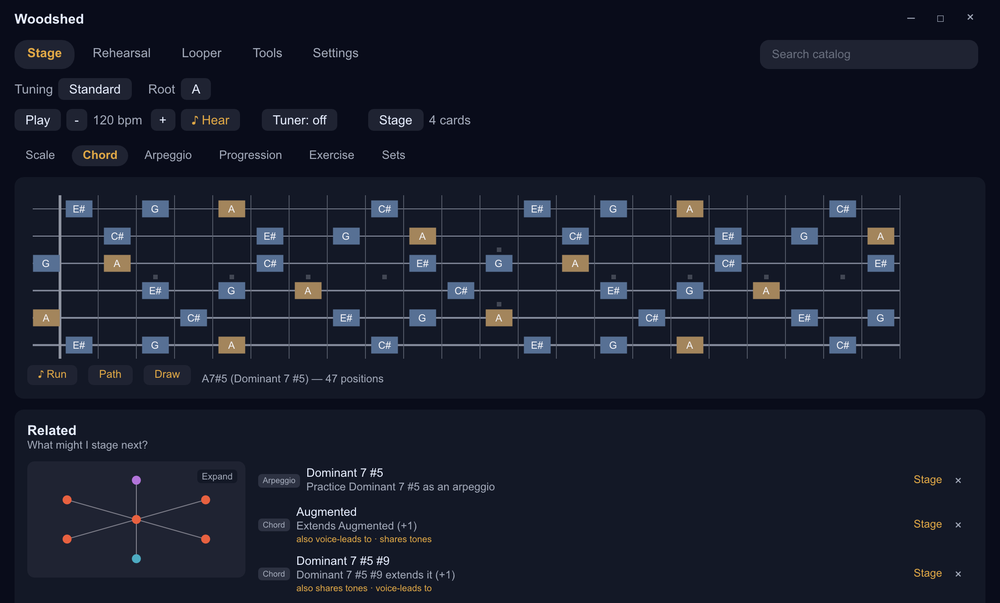

# Woodshed

Woodshed is an offline-first practice toolkit for guitar and other fretted
instruments. Its catalogs stage chords, scales, arpeggios, progressions, and
exercises into an ordered practice Set; Rehearsal streams that Set as guided
practice, and the Looper repeats it for live-input recording. A fretboard,
tuner, metronome, MIDI clock, and latency calibration round out the practice
environment. The theory model supports arbitrary string counts and tunings.

<p align="center">
  <br>
  <sub>Stage: inspect a playable chord across the neck, then stage related practice material.</sub>
</p>

## Status (2026-08-12)

Desktop alpha, functional on Windows. Not a packaged public release yet;
source builds are the supported way to try it.

- Migrated onto the shared Cambium desktop host
  (`cambium-genet-winit-host` in the genet repo) on 2026-08-09. Woodshed was
  the donor of that host and is its first consumer; the app binary shrank
  from 1728 to 211 lines of host code, and both semantic scenario receipts
  pass unchanged.
- Practice sessions are sealed at rest under a persona-derived key with
  carry across devices (2026-08-08); application settings split into their
  own file with one-time migration (2026-08-07).
- Window frame moved onto the host seam 2026-08-10; window-chrome controls
  are named for screen readers.
- Seven crates: `woodshedding` (pure theory model), `audio-primitives`
  (pure-std DSP, also consumed by sibling repos), `woodshed-audio` (cpal,
  pitch detection, MIDI, looping), `woodshed-core` (portable state and host
  seams), `woodshed-views` (Cambium product views and CSS themes),
  `woodshed-genet` (the desktop binary), `woodshed-graph` (theory catalog
  as a content graph).

Current plans live in [design_docs/](design_docs/DOC_README.md). Next:
Stage's graph projection of the practice Set on scenograph (gate opened
2026-08-10), then adaptive-screen polish, Mac and Linux receipts, and a
public build path.

## Use

```sh
cargo run -p woodshed-genet     # the desktop app
cargo test --workspace
```

The committed manifest resolves the genet family from git. Local sibling
development needs a gitignored `.cargo/config.toml` patch table that
includes `cambium-genet-winit-host` and `meristem`.
`scripts/package-windows.ps1` produces a checksummed portable Windows ZIP.

## License

MIT OR Apache-2.0. Contributions are dual licensed as above unless
explicitly stated otherwise.

---

*This README was generated by AI and will be edited by the author upon
release.*
